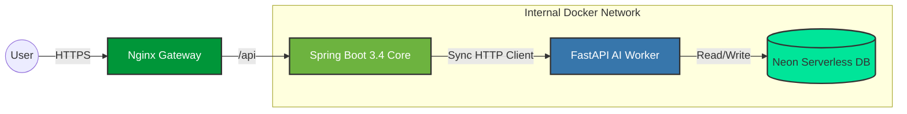

# Cortex Platform

> **A High-Performance Modular Monolith demonstrating Polyglot Orchestration.**
> *Spring Boot 3.4 (Core) + FastAPI (AI/Data) + Vue 3 (Client)*

---

## 🏗 Architectural Strategy

Cortex Platform is engineered as a **Modular Monolith**. It leverages the robustness of the Java ecosystem for core business logic and security, while seamlessly offloading high-compute AI tasks to a specialized Python worker. 

This architecture minimizes infrastructure overhead while maintaining strict service boundaries using Docker orchestration.

