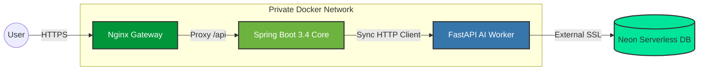

# Cortex Platform

> **A High-Performance Modular Monolith demonstrating Polyglot Orchestration.**
> *Spring Boot 3.4 (Core) + FastAPI (AI/Data) + Vue 3 (Client)*

---

## 🏗 Architectural Strategy

Cortex Platform is engineered as a **Modular Monolith**. It leverages the robustness of the Java ecosystem for core business logic and security, while seamlessly offloading high-compute AI tasks to a specialized Python worker.

The diagram below illustrates the network topology: Nginx acts as the secure entry point, proxying traffic to the Spring Boot core within the private Docker network. Spring Boot then orchestrates asynchronous data tasks with the Python worker, which persists data to the external Serverless Postgres instance.

